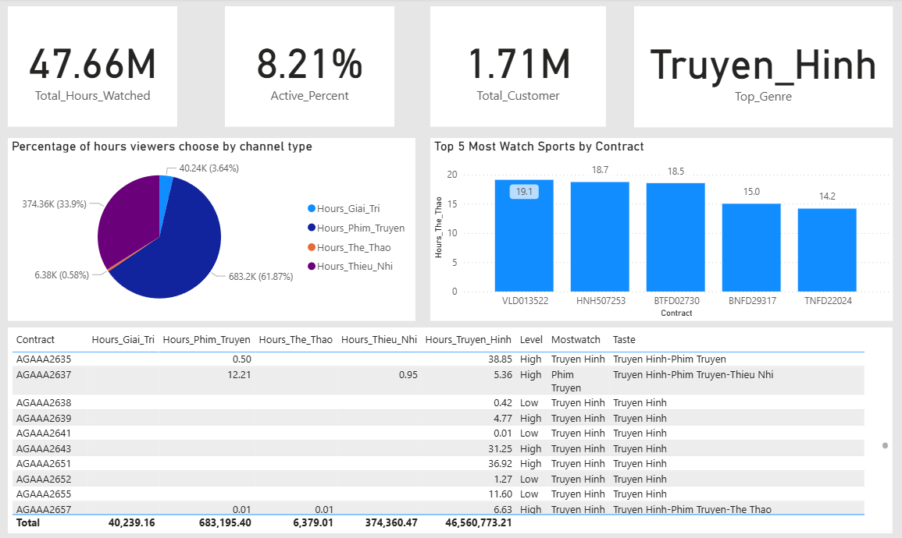

# 🚀 Big Data ETL Pipeline for User Behavior Analytics with PySpark

This project demonstrates an end-to-end ETL (Extract, Transform, Load) pipeline built with **Apache Spark (PySpark)** to process and analyze large-scale TV content viewing data. The final dataset is loaded into a **MySQL** database and visualized using **Power BI**.

---

## 📌 Project Overview

- ✅ Built with **PySpark** to handle **large-scale JSON logs** efficiently.
- ✅ Categorized content based on `AppName` into user-friendly types (e.g., TV, Movies, Entertainment, Sports).
- ✅ Calculated key **user behavior metrics**:
  - **Mostwatched Content Type**
  - **Taste Preferences**
  - **Active Level (Engagement over time)**
  - **Watching Total hours  by channel**
- ✅ Stored results in **MySQL** for downstream analytics or BI integration.
- ✅ Visualized results in an interactive **Power BI dashboard**.

---

## 🛠️ Tech Stack

| Component      | Description                                      |
|----------------|--------------------------------------------------|
| PySpark        | Distributed processing of JSON data              |
| Pandas         | Date range handling and auxiliary logic          |
| MySQL          | Target data warehouse for storing aggregated data|
| Power BI       | Visualization of final behavioral metrics        |
| JSON           | Raw input data format                            |

---

## 🗂️ Project Structure
bigdata-etl-user-behavior-pyspark/
│

├── etl_customer_behavior.py # Main ETL script

├── datasamples(7days)/

│
│ └── 20220401.json # Example raw JSON log

│ └── 20220402.json # Example raw JSON log

│ └── 20220403.json # Example raw JSON log

│ └── 20220404.json # Example raw JSON log

│ └── 20220405.json # Example raw JSON log

│ └── 20220406.json # Example raw JSON log

│ └── 20220407.json # Example raw JSON log

│
├── Content_Consumption_Insights.pbix # Power BI dashboard file

├── mysql-connector-j-8.0.33.jar

├── mysql-connector-net-9.3.0

│
├── README.md # Project documentation

## 🔄 ETL Flow

1. **Extract**
   - Load JSON files daily from a folder.
   - Flatten nested fields and normalize the schema.

2. **Transform**
   - Categorize `AppName` into content types.
   - Pivot data by user `Contract` and `Content Type`.
   - Compute behavior metrics:
     - `Mostwatch`: Dominant content type watched
     - `Taste`: All genres the user interacts with
     - `Active`: Count of active days
     - `Level`: High vs Low activity engagement

3. **Load**
   - Append final transformed data into MySQL table: `customer_content_stats`.

---
📈 Sample Output
## 📈 Sample Output Schema

| Column               | Type       | Description                                 |
|----------------------|------------|---------------------------------------------|
| Contract             | string     | Unique user identifier                      |
| Total_Giai_Tri       | bigint     | Total duration of Entertainment content     |
| Total_Phim_Truyen    | bigint     | Total duration of Movie content             |
| Total_The_Thao       | bigint     | Total duration of Sports content            |
| Total_Thieu_Nhi      | bigint     | Total duration of Children content          |
| Total_Truyen_Hinh    | bigint     | Total duration of TV content                |
| Active               | bigint     | Number of days the user was active          |
| Mostwatch            | string     | Most-watched content type                   |
| Taste                | string     | Genres the user interacted with             |
| Level                | string     | User engagement level (High / Low)          |

📊 Example Table Output
| Contract | Total_Giai_Tri | Total_Phim_Truyen | Total_The_Thao | Total_Thieu_Nhi | Total_Truyen_Hinh | Active | Mostwatch   | Taste                                     | Level |
|----------|----------------|-------------------|----------------|------------------|--------------------|--------|-------------|---------------------------------------  |--------|
| 10001    | 1800           | 2200              | 400            | 0                | 2600               | 6      | Truyen Hinh | Giai Tri-Truyen Hinh-Phim Truyen        | High   |
| 10002    | 0              | 1200              | 0              | 0                | 0                  | 1      | Phim Truyen | Phim Truyen                             | Low    |
| 10003    | 800            | 0                 | 1100           | 300              | 900                | 5      | The Thao    | Giai Tri-The Thao-Truyen Hinh-Thieu Nhi | High   |

📊 Power BI Dashboard
The dashboard provides:

Distribution of content preferences

Mostwatched types by customer

User segmentation by activity level

Time-series patterns of engagement

📬 Contact

👨‍💻 Author: Ha Thuy Nguyen
